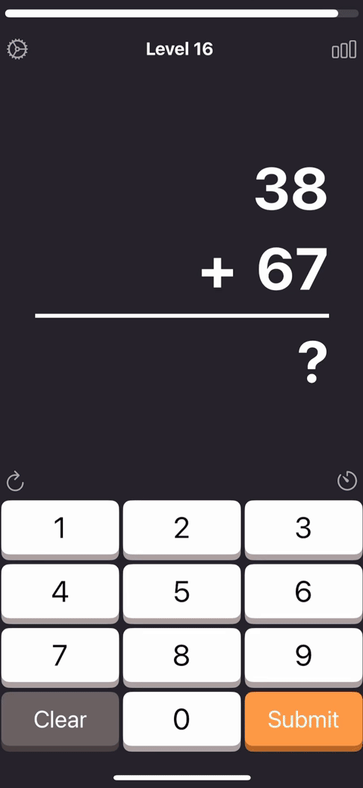
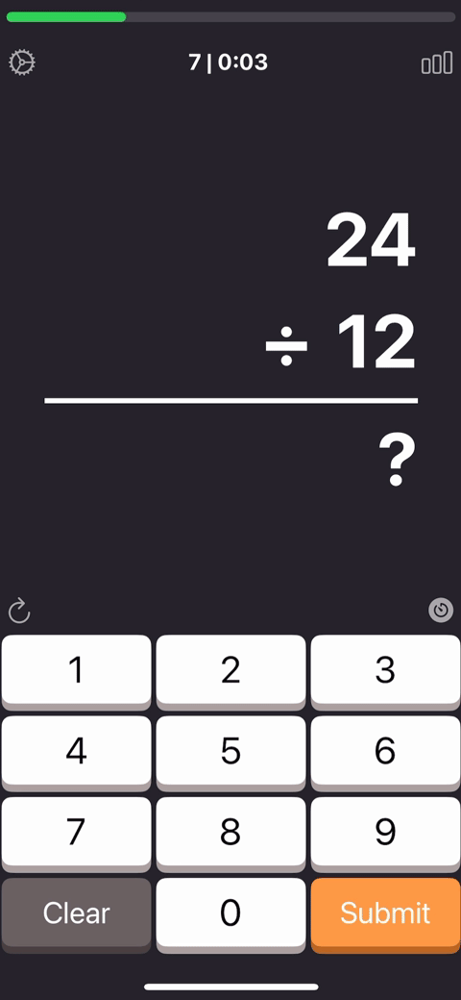

# Math Champs iOS App

  

A thrilling educational app that challenges your mental math skills through fast-paced exercises and adrenaline-pumping timed challenges!

## Supercharge Your Math Skills!

Math Champs transforms boring arithmetic into an exciting game that sharpens your mind and makes calculations fun. Race against the clock, beat your high scores, and watch your mental math abilities soar to new heights!

## App in Action

  
  
  

## Getting Started

1. Clone the repository
2. Open `Math Champs.xcodeproj` in Xcode
3. Build and run the project (requires Xcode 14+ and iOS 16.6+)

## App Store
~~[Download on the App Store](https://apps.apple.com/us/app/id6670761620?ct=Tap33750451)~~

## A Fond Farewell

Math Champs went offline at the end of January 2025. Thank you to all our users who made this journey amazing!

## Contact

If you have any questions about the implementation or want to discuss how this project helped you, please reach out.